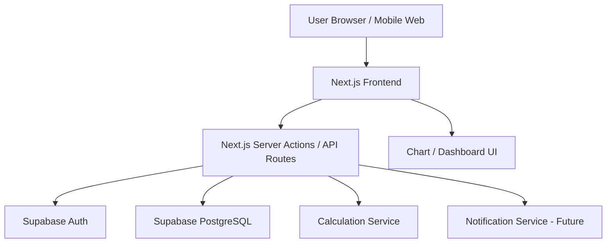

以下是可以直接交給工程師 / AI coding tool / Cursor / GitHub Spark / Lovable 使用的 **Technical Design Document 技術設計文件**。
我會以你前面定義的產品定位：「共同選股、共同決策、共同投資紀錄」作為核心來設計。你上傳的檔案是 Technical Design Document Generator 範本，我這份文件會依照該範本的技術文件方向整理，但內容已經改成你的投資小組 APP。

---

# Technical Design Document

# 共同選股研究室 APP MVP

## 0. 文件目的

本文件定義「共同選股研究室 APP」第一版 MVP 的技術設計。

這個 APP 的核心不是讓使用者各自買股票，也不是做單純排行榜，而是讓一群朋友建立一套共同投資決策流程：

```text
提出標的
→ 小組討論
→ 補充優點
→ 揭露風險
→ 反方檢查
→ 評分
→ 投票
→ 進入小組共識名單
→ 成員選擇是否跟進
→ 記錄買賣
→ 計算百分比報酬率
→ 復盤
```

第一版技術目標是：

* 快速做出可用 MVP
* 支援小組、提案、討論、投票、共識名單
* 支援個人買進 / 賣出紀錄
* 支援百分比報酬率計算
* 支援小組平均報酬率與中位數報酬率
* 支援基本排行榜
* 支援復盤紀錄
* 避免一開始就過度複雜化

---

# 1. 建議技術方向

## 1.1 MVP 建議平台

第一版建議做：

```text
Web App + Mobile Responsive
```

也就是先做成可以在手機瀏覽器上使用的 Web App。

未來如果需要上架 iOS App，可以再用：

```text
Capacitor
或
React Native
或
Flutter
```

把核心功能轉成 Mobile App。

---

## 1.2 為什麼第一版建議先做 Web App

原因：

1. 開發速度最快
2. 不需要一開始處理 App Store 上架
3. 小組成員可以直接用網址加入
4. 適合 MVP 驗證
5. 可以快速修改功能
6. 後續仍可封裝成 iOS / Android App
7. 投資紀錄與討論功能本質上很適合 Web App

---

## 1.3 推薦技術 Stack

### 第一版推薦 Stack

| 層級              | 技術                                  |
| --------------- | ----------------------------------- |
| Frontend        | Next.js + React + TypeScript        |
| UI              | Tailwind CSS + shadcn/ui            |
| Backend         | Next.js API Routes / Server Actions |
| Database        | Supabase PostgreSQL                 |
| Auth            | Supabase Auth                       |
| Hosting         | Vercel                              |
| Chart           | Recharts                            |
| Form Validation | Zod                                 |
| ORM             | Prisma 或 Supabase Client            |
| Analytics       | PostHog 或 Vercel Analytics          |
| Error Tracking  | Sentry                              |
| AI Coding Tool  | Cursor / GitHub Copilot / ChatGPT   |

---

## 1.4 技術選型理由

### Next.js

適合原因：

* 可以同時做前端與後端
* 適合快速做 MVP
* 支援 Server Components / API Routes
* 很適合部署到 Vercel
* React 生態系成熟
* AI coding tool 對 Next.js 支援很好

---

### Supabase

適合原因：

* 提供 PostgreSQL database
* 提供 Auth
* 提供 Row Level Security
* 提供 REST / Realtime / Storage
* 免費方案足夠 MVP 使用
* 不需要自己維護後端伺服器

---

### Tailwind CSS + shadcn/ui

適合原因：

* 快速做出乾淨現代化 UI
* 很適合 Dashboard / Card / Table / Form
* AI 工具產出品質穩定
* 後續容易客製化

---

### Vercel

適合原因：

* Next.js 原生整合
* GitHub push 後自動部署
* MVP 階段成本低
* 適合小型 SaaS / Web App

---

# 2. 架構總覽

## 2.1 High-Level Architecture



---

## 2.2 系統模組

| 模組                  | 說明             |
| ------------------- | -------------- |
| Auth Module         | 登入、註冊、小組成員身份   |
| Group Module        | 建立投資小組、邀請成員    |
| Proposal Module     | 股票提案池          |
| Discussion Module   | 優點、風險、留言、反方意見  |
| Scoring Module      | 成員評分           |
| Voting Module       | 成員投票與共識門檻      |
| Consensus Module    | 小組共識名單         |
| Trade Record Module | 成員買進 / 賣出紀錄    |
| Performance Module  | 報酬率、勝率、中位數、平均數 |
| Ranking Module      | 排行榜            |
| Review Module       | 復盤紀錄           |
| Admin Module        | 小組設定、門檻設定      |

---

# 3. 資料庫設計

## 3.1 Entity Relationship Overview

主要資料表：

```text
users
groups
group_members
stock_proposals
proposal_bull_points
proposal_risk_points
proposal_comments
proposal_scores
proposal_votes
consensus_stocks
trade_records
performance_snapshots
reviews
ranking_metrics
```

---

# 4. Database Schema

以下使用 PostgreSQL 設計。

---

## 4.1 users

使用者表。

```sql
CREATE TABLE users (
    id UUID PRIMARY KEY DEFAULT gen_random_uuid(),
    email TEXT UNIQUE NOT NULL,
    display_name TEXT NOT NULL,
    avatar_url TEXT,
    created_at TIMESTAMP DEFAULT NOW(),
    updated_at TIMESTAMP DEFAULT NOW()
);
```

---

## 4.2 groups

投資小組表。

```sql
CREATE TABLE groups (
    id UUID PRIMARY KEY DEFAULT gen_random_uuid(),
    name TEXT NOT NULL,
    description TEXT,
    owner_id UUID REFERENCES users(id),
    consensus_agree_threshold NUMERIC DEFAULT 0.70,
    consensus_score_threshold NUMERIC DEFAULT 75,
    min_bull_points INT DEFAULT 3,
    min_risk_points INT DEFAULT 2,
    require_bear_reviewer BOOLEAN DEFAULT TRUE,
    created_at TIMESTAMP DEFAULT NOW(),
    updated_at TIMESTAMP DEFAULT NOW()
);
```

---

## 4.3 group_members

小組成員表。

```sql
CREATE TABLE group_members (
    id UUID PRIMARY KEY DEFAULT gen_random_uuid(),
    group_id UUID REFERENCES groups(id) ON DELETE CASCADE,
    user_id UUID REFERENCES users(id) ON DELETE CASCADE,
    role TEXT NOT NULL DEFAULT 'member',
    joined_at TIMESTAMP DEFAULT NOW(),
    UNIQUE(group_id, user_id)
);
```

### role values

```text
owner
admin
member
viewer
```

---

## 4.4 stock_proposals

股票提案表。

```sql
CREATE TABLE stock_proposals (
    id UUID PRIMARY KEY DEFAULT gen_random_uuid(),
    group_id UUID REFERENCES groups(id) ON DELETE CASCADE,
    proposer_id UUID REFERENCES users(id),
    
    ticker TEXT NOT NULL,
    stock_name TEXT NOT NULL,
    market TEXT,
    proposal_price NUMERIC,
    proposal_date DATE DEFAULT CURRENT_DATE,
    
    investment_thesis TEXT NOT NULL,
    target_price NUMERIC,
    stop_loss_price NUMERIC,
    exit_condition TEXT,
    expected_holding_days INT,
    
    status TEXT NOT NULL DEFAULT 'draft',
    bear_reviewer_id UUID REFERENCES users(id),
    
    created_at TIMESTAMP DEFAULT NOW(),
    updated_at TIMESTAMP DEFAULT NOW()
);
```

### status values

```text
draft
submitted
discussion
risk_insufficient
bear_review
voting
approved
rejected
watchlist
closed
```

---

## 4.5 proposal_bull_points

看多理由表。

```sql
CREATE TABLE proposal_bull_points (
    id UUID PRIMARY KEY DEFAULT gen_random_uuid(),
    proposal_id UUID REFERENCES stock_proposals(id) ON DELETE CASCADE,
    user_id UUID REFERENCES users(id),
    content TEXT NOT NULL,
    category TEXT,
    created_at TIMESTAMP DEFAULT NOW()
);
```

### category examples

```text
fundamental
industry_trend
valuation
technical
chip
news
other
```

---

## 4.6 proposal_risk_points

風險提醒表。

```sql
CREATE TABLE proposal_risk_points (
    id UUID PRIMARY KEY DEFAULT gen_random_uuid(),
    proposal_id UUID REFERENCES stock_proposals(id) ON DELETE CASCADE,
    user_id UUID REFERENCES users(id),
    content TEXT NOT NULL,
    category TEXT,
    severity TEXT DEFAULT 'medium',
    happened BOOLEAN DEFAULT FALSE,
    happened_note TEXT,
    created_at TIMESTAMP DEFAULT NOW(),
    updated_at TIMESTAMP DEFAULT NOW()
);
```

### severity values

```text
low
medium
high
critical
```

---

## 4.7 proposal_comments

討論留言表。

```sql
CREATE TABLE proposal_comments (
    id UUID PRIMARY KEY DEFAULT gen_random_uuid(),
    proposal_id UUID REFERENCES stock_proposals(id) ON DELETE CASCADE,
    user_id UUID REFERENCES users(id),
    content TEXT NOT NULL,
    comment_type TEXT DEFAULT 'general',
    created_at TIMESTAMP DEFAULT NOW()
);
```

### comment_type values

```text
general
question
bear_argument
clarification
follow_up
```

---

## 4.8 proposal_scores

評分表。

```sql
CREATE TABLE proposal_scores (
    id UUID PRIMARY KEY DEFAULT gen_random_uuid(),
    proposal_id UUID REFERENCES stock_proposals(id) ON DELETE CASCADE,
    user_id UUID REFERENCES users(id),

    fundamental_score INT CHECK (fundamental_score BETWEEN 1 AND 20),
    industry_score INT CHECK (industry_score BETWEEN 1 AND 20),
    valuation_score INT CHECK (valuation_score BETWEEN 1 AND 20),
    risk_control_score INT CHECK (risk_control_score BETWEEN 1 AND 20),
    plan_score INT CHECK (plan_score BETWEEN 1 AND 20),

    total_score INT GENERATED ALWAYS AS (
        fundamental_score 
        + industry_score 
        + valuation_score 
        + risk_control_score 
        + plan_score
    ) STORED,

    created_at TIMESTAMP DEFAULT NOW(),
    updated_at TIMESTAMP DEFAULT NOW(),

    UNIQUE(proposal_id, user_id)
);
```

---

## 4.9 proposal_votes

投票表。

```sql
CREATE TABLE proposal_votes (
    id UUID PRIMARY KEY DEFAULT gen_random_uuid(),
    proposal_id UUID REFERENCES stock_proposals(id) ON DELETE CASCADE,
    user_id UUID REFERENCES users(id),
    vote TEXT NOT NULL,
    reason TEXT,
    created_at TIMESTAMP DEFAULT NOW(),
    updated_at TIMESTAMP DEFAULT NOW(),

    UNIQUE(proposal_id, user_id)
);
```

### vote values

```text
agree
disagree
need_more_info
watch_later
```

---

## 4.10 consensus_stocks

小組共識標的表。

當提案通過共識門檻後，系統建立一筆 consensus stock。

```sql
CREATE TABLE consensus_stocks (
    id UUID PRIMARY KEY DEFAULT gen_random_uuid(),
    proposal_id UUID REFERENCES stock_proposals(id),
    group_id UUID REFERENCES groups(id) ON DELETE CASCADE,

    ticker TEXT NOT NULL,
    stock_name TEXT NOT NULL,
    market TEXT,

    consensus_date DATE DEFAULT CURRENT_DATE,
    consensus_price NUMERIC,
    consensus_reason TEXT,
    consensus_target_price NUMERIC,
    consensus_stop_loss_price NUMERIC,

    status TEXT DEFAULT 'active',

    created_at TIMESTAMP DEFAULT NOW(),
    updated_at TIMESTAMP DEFAULT NOW()
);
```

### status values

```text
active
watching
closed
cancelled
```

---

## 4.11 trade_records

成員交易紀錄表。

```sql
CREATE TABLE trade_records (
    id UUID PRIMARY KEY DEFAULT gen_random_uuid(),
    consensus_stock_id UUID REFERENCES consensus_stocks(id) ON DELETE CASCADE,
    group_id UUID REFERENCES groups(id) ON DELETE CASCADE,
    user_id UUID REFERENCES users(id),

    followed BOOLEAN DEFAULT TRUE,

    buy_date DATE,
    buy_price NUMERIC,
    quantity NUMERIC,
    invested_amount NUMERIC,

    sell_date DATE,
    sell_price NUMERIC,
    sell_quantity NUMERIC,
    realized_pnl NUMERIC,

    current_price NUMERIC,
    unrealized_return_pct NUMERIC,
    realized_return_pct NUMERIC,
    final_return_pct NUMERIC,

    holding_days INT,
    followed_original_plan BOOLEAN,
    note TEXT,

    status TEXT DEFAULT 'holding',

    created_at TIMESTAMP DEFAULT NOW(),
    updated_at TIMESTAMP DEFAULT NOW()
);
```

### status values

```text
not_followed
holding
partial_sold
closed
```

---

## 4.12 trade_lots

如果要支援分批買進，建議新增 trade_lots。

```sql
CREATE TABLE trade_lots (
    id UUID PRIMARY KEY DEFAULT gen_random_uuid(),
    trade_record_id UUID REFERENCES trade_records(id) ON DELETE CASCADE,
    action TEXT NOT NULL,
    trade_date DATE NOT NULL,
    price NUMERIC NOT NULL,
    quantity NUMERIC NOT NULL,
    amount NUMERIC GENERATED ALWAYS AS (price * quantity) STORED,
    created_at TIMESTAMP DEFAULT NOW()
);
```

### action values

```text
buy
sell
```

---

## 4.13 reviews

復盤表。

```sql
CREATE TABLE reviews (
    id UUID PRIMARY KEY DEFAULT gen_random_uuid(),
    consensus_stock_id UUID REFERENCES consensus_stocks(id) ON DELETE CASCADE,
    group_id UUID REFERENCES groups(id) ON DELETE CASCADE,

    thesis_valid BOOLEAN,
    target_reached BOOLEAN,
    stop_loss_triggered BOOLEAN,
    risks_happened TEXT,
    correct_judgements TEXT,
    wrong_judgements TEXT,
    lesson_learned TEXT,
    next_time_improvement TEXT,

    created_by UUID REFERENCES users(id),
    created_at TIMESTAMP DEFAULT NOW(),
    updated_at TIMESTAMP DEFAULT NOW()
);
```

---

# 5. 核心商業邏輯

## 5.1 共識門檻計算

一檔股票可以進入小組共識名單，需要符合：

```text
同意比例 >= 70%
平均評分 >= 75
看多理由 >= 3
風險提醒 >= 2
至少 1 位反方
提案人已填寫買進邏輯
提案人已填寫目標價
提案人已填寫停損價或退出條件
沒有未處理的重大反對意見
```

---

## 5.2 共識檢查 Function

Pseudo code：

```typescript
type ConsensusCheckResult = {
  passed: boolean;
  agreeRatio: number;
  averageScore: number;
  bullPointCount: number;
  riskPointCount: number;
  hasBearReviewer: boolean;
  missingItems: string[];
  warnings: string[];
};

async function checkConsensusEligibility(proposalId: string): Promise<ConsensusCheckResult> {
  const proposal = await getProposal(proposalId);
  const group = await getGroup(proposal.groupId);

  const votes = await getVotes(proposalId);
  const scores = await getScores(proposalId);
  const bullPoints = await getBullPoints(proposalId);
  const riskPoints = await getRiskPoints(proposalId);
  const comments = await getComments(proposalId);

  const agreeVotes = votes.filter(v => v.vote === 'agree').length;
  const totalVotes = votes.length;
  const agreeRatio = totalVotes === 0 ? 0 : agreeVotes / totalVotes;

  const averageScore =
    scores.length === 0
      ? 0
      : scores.reduce((sum, s) => sum + s.totalScore, 0) / scores.length;

  const missingItems: string[] = [];
  const warnings: string[] = [];

  if (agreeRatio < group.consensusAgreeThreshold) {
    missingItems.push('同意比例未達門檻');
  }

  if (averageScore < group.consensusScoreThreshold) {
    missingItems.push('平均評分未達門檻');
  }

  if (bullPoints.length < group.minBullPoints) {
    missingItems.push('看多理由不足');
  }

  if (riskPoints.length < group.minRiskPoints) {
    missingItems.push('風險提醒不足');
  }

  if (group.requireBearReviewer && !proposal.bearReviewerId) {
    missingItems.push('尚未指定反方成員');
  }

  if (!proposal.investmentThesis) {
    missingItems.push('缺少買進邏輯');
  }

  if (!proposal.targetPrice) {
    missingItems.push('缺少目標價');
  }

  if (!proposal.stopLossPrice && !proposal.exitCondition) {
    missingItems.push('缺少停損價或退出條件');
  }

  if (riskPoints.length < group.minRiskPoints && bullPoints.length >= group.minBullPoints) {
    warnings.push('目前討論偏向單邊樂觀，建議補充風險後再決策。');
  }

  return {
    passed: missingItems.length === 0,
    agreeRatio,
    averageScore,
    bullPointCount: bullPoints.length,
    riskPointCount: riskPoints.length,
    hasBearReviewer: Boolean(proposal.bearReviewerId),
    missingItems,
    warnings
  };
}
```

---

# 6. 報酬率計算邏輯

## 6.1 個人單筆報酬率

```typescript
function calculateSingleReturnPct(buyPrice: number, sellPrice: number): number {
  return ((sellPrice - buyPrice) / buyPrice) * 100;
}
```

---

## 6.2 平均買進成本

支援分批買進：

```typescript
type TradeLot = {
  action: 'buy' | 'sell';
  price: number;
  quantity: number;
};

function calculateAverageBuyCost(lots: TradeLot[]): number {
  const buyLots = lots.filter(lot => lot.action === 'buy');

  const totalAmount = buyLots.reduce(
    (sum, lot) => sum + lot.price * lot.quantity,
    0
  );

  const totalQuantity = buyLots.reduce(
    (sum, lot) => sum + lot.quantity,
    0
  );

  if (totalQuantity === 0) return 0;

  return totalAmount / totalQuantity;
}
```

---

## 6.3 個人未實現報酬率

```typescript
function calculateUnrealizedReturnPct(
  currentPrice: number,
  averageBuyCost: number
): number {
  if (averageBuyCost === 0) return 0;

  return ((currentPrice - averageBuyCost) / averageBuyCost) * 100;
}
```

---

## 6.4 個人已實現報酬率

```typescript
function calculateRealizedReturnPct(
  realizedPnl: number,
  investedCost: number
): number {
  if (investedCost === 0) return 0;

  return (realizedPnl / investedCost) * 100;
}
```

---

## 6.5 小組標的平均報酬率

注意：這裡不使用投入金額加權。

```typescript
function calculateGroupAverageReturnPct(memberReturns: number[]): number {
  if (memberReturns.length === 0) return 0;

  const total = memberReturns.reduce((sum, r) => sum + r, 0);
  return total / memberReturns.length;
}
```

---

## 6.6 小組標的中位數報酬率

```typescript
function calculateMedianReturnPct(memberReturns: number[]): number {
  if (memberReturns.length === 0) return 0;

  const sorted = [...memberReturns].sort((a, b) => a - b);
  const mid = Math.floor(sorted.length / 2);

  if (sorted.length % 2 === 0) {
    return (sorted[mid - 1] + sorted[mid]) / 2;
  }

  return sorted[mid];
}
```

---

## 6.7 小組總平均報酬率

以每一檔共識標的的平均報酬率計算，不以所有投入金額加總計算。

```typescript
function calculateGroupTotalAverageReturnPct(consensusStockReturns: number[]): number {
  if (consensusStockReturns.length === 0) return 0;

  const total = consensusStockReturns.reduce((sum, r) => sum + r, 0);
  return total / consensusStockReturns.length;
}
```

---

## 6.8 成員勝率

```typescript
function calculateWinRate(memberReturns: number[]): number {
  if (memberReturns.length === 0) return 0;

  const wins = memberReturns.filter(r => r > 0).length;
  return (wins / memberReturns.length) * 100;
}
```

---

## 6.9 平均獲利率

```typescript
function calculateAverageWinPct(memberReturns: number[]): number {
  const wins = memberReturns.filter(r => r > 0);

  if (wins.length === 0) return 0;

  return wins.reduce((sum, r) => sum + r, 0) / wins.length;
}
```

---

## 6.10 平均虧損率

```typescript
function calculateAverageLossPct(memberReturns: number[]): number {
  const losses = memberReturns.filter(r => r < 0);

  if (losses.length === 0) return 0;

  return losses.reduce((sum, r) => sum + r, 0) / losses.length;
}
```

---

## 6.11 盈虧比

```typescript
function calculateProfitLossRatio(avgWinPct: number, avgLossPct: number): number {
  if (avgLossPct === 0) return 0;

  return avgWinPct / Math.abs(avgLossPct);
}
```

---

## 6.12 年化報酬率

```typescript
function calculateAnnualizedReturnPct(
  holdingReturnPct: number,
  holdingDays: number
): number {
  if (holdingDays <= 0) return 0;

  const decimalReturn = holdingReturnPct / 100;
  const annualized = Math.pow(1 + decimalReturn, 365 / holdingDays) - 1;

  return annualized * 100;
}
```

---

# 7. API 設計

## 7.1 Auth

Supabase Auth 處理：

```text
POST /auth/signup
POST /auth/login
POST /auth/logout
GET  /auth/me
```

實作上可直接使用 Supabase client，不一定需要自己寫 API。

---

## 7.2 Group API

```text
POST   /api/groups
GET    /api/groups
GET    /api/groups/:groupId
PATCH  /api/groups/:groupId
DELETE /api/groups/:groupId
```

### Create Group Request

```typescript
type CreateGroupRequest = {
  name: string;
  description?: string;
};
```

---

## 7.3 Group Member API

```text
POST   /api/groups/:groupId/invite
GET    /api/groups/:groupId/members
PATCH  /api/groups/:groupId/members/:memberId
DELETE /api/groups/:groupId/members/:memberId
```

---

## 7.4 Proposal API

```text
POST   /api/groups/:groupId/proposals
GET    /api/groups/:groupId/proposals
GET    /api/proposals/:proposalId
PATCH  /api/proposals/:proposalId
DELETE /api/proposals/:proposalId
```

### Create Proposal Request

```typescript
type CreateProposalRequest = {
  ticker: string;
  stockName: string;
  market?: string;
  proposalPrice?: number;
  investmentThesis: string;
  targetPrice?: number;
  stopLossPrice?: number;
  exitCondition?: string;
  expectedHoldingDays?: number;
};
```

---

## 7.5 Bull Point API

```text
POST   /api/proposals/:proposalId/bull-points
GET    /api/proposals/:proposalId/bull-points
DELETE /api/bull-points/:bullPointId
```

---

## 7.6 Risk Point API

```text
POST   /api/proposals/:proposalId/risk-points
GET    /api/proposals/:proposalId/risk-points
PATCH  /api/risk-points/:riskPointId
DELETE /api/risk-points/:riskPointId
```

---

## 7.7 Score API

```text
POST  /api/proposals/:proposalId/scores
GET   /api/proposals/:proposalId/scores
PATCH /api/proposals/:proposalId/scores/me
```

---

## 7.8 Vote API

```text
POST /api/proposals/:proposalId/votes
GET  /api/proposals/:proposalId/votes
```

---

## 7.9 Consensus API

```text
POST /api/proposals/:proposalId/check-consensus
POST /api/proposals/:proposalId/approve
GET  /api/groups/:groupId/consensus-stocks
GET  /api/consensus-stocks/:consensusStockId
PATCH /api/consensus-stocks/:consensusStockId
```

---

## 7.10 Trade Record API

```text
POST   /api/consensus-stocks/:consensusStockId/trades
GET    /api/consensus-stocks/:consensusStockId/trades
GET    /api/users/me/trades
PATCH  /api/trades/:tradeId
DELETE /api/trades/:tradeId
```

---

## 7.11 Performance API

```text
GET /api/groups/:groupId/performance
GET /api/consensus-stocks/:consensusStockId/performance
GET /api/users/:userId/performance
```

---

## 7.12 Ranking API

```text
GET /api/groups/:groupId/rankings/consensus-stocks
GET /api/groups/:groupId/rankings/members
GET /api/groups/:groupId/rankings/proposers
GET /api/groups/:groupId/rankings/risk-reviewers
GET /api/groups/:groupId/rankings/stability
```

---

## 7.13 Review API

```text
POST  /api/consensus-stocks/:consensusStockId/reviews
GET   /api/consensus-stocks/:consensusStockId/reviews
PATCH /api/reviews/:reviewId
```

---

# 8. 前端頁面設計

## 8.1 Routes

使用 Next.js App Router。

```text
/
  首頁

/login
  登入

/signup
  註冊

/groups
  我的投資小組列表

/groups/[groupId]
  小組 Dashboard

/groups/[groupId]/proposals
  提案池

/groups/[groupId]/proposals/new
  新增提案

/proposals/[proposalId]
  提案詳情頁

/groups/[groupId]/consensus
  小組共識名單

/consensus/[consensusStockId]
  共識標的詳情

/consensus/[consensusStockId]/trade
  我的跟進紀錄

/groups/[groupId]/performance
  小組績效

/groups/[groupId]/rankings
  排行榜

/consensus/[consensusStockId]/review
  復盤頁
```

---

# 9. UI Component Design

## 9.1 共用 Components

```text
components/
├── ui/
│   ├── Button.tsx
│   ├── Card.tsx
│   ├── Badge.tsx
│   ├── Dialog.tsx
│   ├── Table.tsx
│   ├── Tabs.tsx
│   ├── Form.tsx
│   └── Progress.tsx
```

---

## 9.2 Feature Components

```text
components/features/
├── group/
│   ├── GroupCard.tsx
│   ├── GroupDashboard.tsx
│   └── MemberList.tsx
│
├── proposal/
│   ├── ProposalCard.tsx
│   ├── ProposalForm.tsx
│   ├── ProposalStatusBadge.tsx
│   ├── BullPointList.tsx
│   ├── RiskPointList.tsx
│   ├── ScorePanel.tsx
│   ├── VotePanel.tsx
│   └── ConsensusCheckPanel.tsx
│
├── consensus/
│   ├── ConsensusStockCard.tsx
│   ├── ConsensusStockDetail.tsx
│   └── FollowTradeForm.tsx
│
├── performance/
│   ├── ReturnSummaryCard.tsx
│   ├── MemberPerformanceTable.tsx
│   ├── ConsensusPerformanceTable.tsx
│   └── ReturnChart.tsx
│
├── ranking/
│   ├── RankingTabs.tsx
│   ├── MemberRankingTable.tsx
│   ├── ProposalRankingTable.tsx
│   └── RiskReviewerRankingTable.tsx
│
└── review/
    ├── ReviewForm.tsx
    └── ReviewSummary.tsx
```

---

# 10. MVP 頁面規格

## 10.1 小組 Dashboard

顯示：

* 小組名稱
* 成員數
* 提案中標的數
* 投票中標的數
* 已通過共識標的數
* 已結案標的數
* 小組平均報酬率
* 小組勝率
* 待我處理的事項

### 待我處理

```text
你還沒評分的提案
你還沒投票的提案
需要你擔任反方的提案
你持有但尚未更新賣出的標的
需要復盤的標的
```

---

## 10.2 提案詳情頁

區塊：

1. 標的基本資料
2. 提案人買進邏輯
3. 目標價 / 停損價 / 退出條件
4. 看多理由列表
5. 風險提醒列表
6. 反方檢查
7. 評分面板
8. 投票面板
9. 共識門檻檢查
10. 留言討論

---

## 10.3 共識標的詳情頁

顯示：

* 股票名稱
* 股票代號
* 共識日期
* 共識價格
* 共識理由
* 目標價
* 停損價
* 跟進成員數
* 小組平均報酬率
* 小組中位數報酬率
* 最高報酬率
* 最低報酬率
* 成員跟進紀錄表

---

## 10.4 個人交易紀錄頁

欄位：

* 股票名稱
* 共識日期
* 買進日期
* 買進價格
* 買進數量
* 投入金額
* 目前價格
* 未實現報酬率
* 賣出日期
* 賣出價格
* 已實現報酬率
* 狀態

---

# 11. 權限設計

## 11.1 Role 權限

| 功能     | Owner | Admin | Member   | Viewer |
| ------ | ----- | ----- | -------- | ------ |
| 建立小組   | Yes   | No    | No       | No     |
| 邀請成員   | Yes   | Yes   | No       | No     |
| 修改小組設定 | Yes   | Yes   | No       | No     |
| 新增提案   | Yes   | Yes   | Yes      | No     |
| 新增看多理由 | Yes   | Yes   | Yes      | No     |
| 新增風險提醒 | Yes   | Yes   | Yes      | No     |
| 評分     | Yes   | Yes   | Yes      | No     |
| 投票     | Yes   | Yes   | Yes      | No     |
| 通過共識   | Yes   | Yes   | Optional | No     |
| 新增交易紀錄 | Yes   | Yes   | Yes      | No     |
| 查看績效   | Yes   | Yes   | Yes      | Yes    |
| 編輯他人交易 | No    | No    | No       | No     |
| 刪除小組   | Yes   | No    | No       | No     |

---

# 12. Security Design

## 12.1 Authentication

使用 Supabase Auth。

支援：

* Email / Password
* Google Login，未來可選
* Magic Link，未來可選

---

## 12.2 Authorization

所有資料都必須檢查：

```text
使用者是否屬於該 group
使用者是否有權限查看 proposal
使用者是否只能編輯自己的 trade record
使用者是否有 admin 權限修改 group setting
```

---

## 12.3 Row Level Security

Supabase 建議啟用 RLS。

範例：

```sql
ALTER TABLE groups ENABLE ROW LEVEL SECURITY;
ALTER TABLE group_members ENABLE ROW LEVEL SECURITY;
ALTER TABLE stock_proposals ENABLE ROW LEVEL SECURITY;
ALTER TABLE trade_records ENABLE ROW LEVEL SECURITY;
```

### 範例 Policy：只能看自己所屬小組資料

```sql
CREATE POLICY "Users can view their group proposals"
ON stock_proposals
FOR SELECT
USING (
  group_id IN (
    SELECT group_id
    FROM group_members
    WHERE user_id = auth.uid()
  )
);
```

---

## 12.4 Sensitive Data 注意事項

這個 APP 會存放：

* 使用者 email
* 小組成員關係
* 投資標的
* 交易紀錄
* 投入金額
* 報酬率

因此必須避免：

* 公開顯示個人投入金額
* 未授權成員查看小組資料
* 讓其他成員編輯別人的交易紀錄
* 用排行榜羞辱虧損成員
* 預設公開所有資料

建議：

```text
個人投入金額預設只給本人看
小組可以選擇是否顯示投入金額
排行榜預設以百分比顯示，不顯示絕對金額
```

---

# 13. Ranking Logic

## 13.1 小組共識標的報酬率排行

排序：

```text
group_average_return_pct DESC
```

最低條件：

```text
跟進人數 >= 2
或
已結案
```

---

## 13.2 成員平均報酬率排行

排序：

```text
member_average_return_pct DESC
```

最低條件：

```text
參與共識標的數 >= 3
```

避免只買一筆剛好大賺就排第一。

---

## 13.3 提案人績效排行

排序：

```text
proposer_approved_stock_average_return_pct DESC
```

指標：

```text
提案數
通過數
通過率
通過標的平均報酬率
通過標的勝率
```

---

## 13.4 風險提醒準確度排行

排序：

```text
risk_hit_rate DESC
```

公式：

```text
risk_hit_rate =
實際發生的風險提醒數 / 總風險提醒數
```

---

## 13.5 最穩定成員排行

排序可以用：

```text
最大回撤 ASC
報酬率標準差 ASC
計畫遵守率 DESC
```

MVP 可先做簡化版：

```text
平均報酬率為正
且
最大單筆虧損最小
```

---

# 14. Performance Calculation Service

建議建立一個集中計算服務。

```text
lib/performance/
├── calculateReturn.ts
├── calculateMedian.ts
├── calculateWinRate.ts
├── calculateDrawdown.ts
├── calculateRanking.ts
└── calculateConsensusMetrics.ts
```

---

## 14.1 calculateConsensusMetrics

```typescript
type ConsensusMetrics = {
  averageReturnPct: number;
  medianReturnPct: number;
  maxReturnPct: number;
  minReturnPct: number;
  winRate: number;
  followerCount: number;
};

function calculateConsensusMetrics(memberReturns: number[]): ConsensusMetrics {
  if (memberReturns.length === 0) {
    return {
      averageReturnPct: 0,
      medianReturnPct: 0,
      maxReturnPct: 0,
      minReturnPct: 0,
      winRate: 0,
      followerCount: 0
    };
  }

  return {
    averageReturnPct: calculateGroupAverageReturnPct(memberReturns),
    medianReturnPct: calculateMedianReturnPct(memberReturns),
    maxReturnPct: Math.max(...memberReturns),
    minReturnPct: Math.min(...memberReturns),
    winRate: calculateWinRate(memberReturns),
    followerCount: memberReturns.length
  };
}
```

---

# 15. Validation Rules

使用 Zod 做表單驗證。

## 15.1 Proposal Form Validation

```typescript
import { z } from "zod";

export const proposalSchema = z.object({
  ticker: z.string().min(1, "請輸入股票代號"),
  stockName: z.string().min(1, "請輸入股票名稱"),
  market: z.string().optional(),
  proposalPrice: z.number().positive().optional(),
  investmentThesis: z.string().min(20, "買進邏輯至少需要 20 個字"),
  targetPrice: z.number().positive("目標價必須大於 0"),
  stopLossPrice: z.number().positive().optional(),
  exitCondition: z.string().optional(),
  expectedHoldingDays: z.number().int().positive().optional()
}).refine(
  data => data.stopLossPrice || data.exitCondition,
  {
    message: "請至少填寫停損價或退出條件",
    path: ["exitCondition"]
  }
);
```

---

## 15.2 Trade Record Validation

```typescript
export const tradeRecordSchema = z.object({
  buyDate: z.string().min(1, "請選擇買進日期"),
  buyPrice: z.number().positive("買進價格必須大於 0"),
  quantity: z.number().positive("買進數量必須大於 0"),
  investedAmount: z.number().positive("投入金額必須大於 0"),
  sellDate: z.string().optional(),
  sellPrice: z.number().positive().optional()
});
```

---

# 16. Error Handling

## 16.1 常見錯誤

| 錯誤      | 顯示訊息             |
| ------- | ---------------- |
| 未登入     | 請先登入             |
| 無小組權限   | 你沒有權限查看此小組       |
| 提案資料不足  | 請補齊必要欄位          |
| 共識門檻未達  | 此標的尚未達成小組共識      |
| 風險提醒不足  | 建議補充風險後再進行投票     |
| 買進價格錯誤  | 買進價格必須大於 0       |
| 報酬率計算失敗 | 請確認買進價格與賣出價格是否正確 |

---

# 17. MVP 開發順序

## Phase 1：基礎建設

目標：讓使用者可以登入、建立小組。

功能：

* Next.js 專案初始化
* Supabase 連線
* Auth
* 建立小組
* 加入小組
* 小組 Dashboard 初版

---

## Phase 2：提案池

目標：成員可以提出股票。

功能：

* 新增提案
* 提案列表
* 提案詳情
* 編輯提案
* 狀態管理

---

## Phase 3：共同討論

目標：成員可以補充優點與風險。

功能：

* 新增看多理由
* 新增風險提醒
* 留言討論
* 指定反方
* 風險不足提醒

---

## Phase 4：評分與投票

目標：讓標的可以進入共識流程。

功能：

* 成員評分
* 成員投票
* 共識門檻計算
* 通過後建立 consensus stock

---

## Phase 5：交易紀錄

目標：成員可以記錄是否跟進與買賣價格。

功能：

* 跟進買入
* 買進紀錄
* 賣出紀錄
* 分批買進初版可先不做，第二版再做
* 個人報酬率計算

---

## Phase 6：績效 Dashboard

目標：顯示小組績效。

功能：

* 個人報酬率
* 小組標的平均報酬率
* 小組標的中位數報酬率
* 小組總平均報酬率
* 勝率
* 基本排行榜

---

## Phase 7：復盤

目標：讓每一筆共識標的可以檢討。

功能：

* 復盤表單
* 風險是否發生
* 買進邏輯是否成立
* 哪裡判斷正確 / 錯誤
* 下次改善

---

# 18. MVP Scope

## 18.1 第一版必做

```text
登入 / 註冊
建立小組
邀請成員
新增股票提案
看多理由
風險提醒
反方角色
評分
投票
共識門檻檢查
小組共識名單
成員跟進買入
買進 / 賣出紀錄
百分比報酬率
小組平均報酬率
小組中位數報酬率
基本排行榜
復盤紀錄
```

---

## 18.2 第一版不做

```text
即時股價 API
自動券商串接
AI 股票分析
公開社群
付費訂閱
多幣別換算
完整資產管理
高頻交易紀錄
複雜風險模型
完整行動 App 上架
```

---

# 19. 未來版本功能

## V2

* 即時股價 API
* 自動更新未實現報酬率
* 通知功能
* 推播提醒
* 更完整排行榜
* 年化報酬率
* 最大回撤
* 盈虧比
* 風險提醒準確度排行
* 反方貢獻排行

---

## V3

* AI 摘要討論內容
* AI 幫忙整理優點 / 風險
* AI 檢查提案是否過度樂觀
* AI 產生復盤摘要
* 券商交易紀錄匯入
* iOS / Android App

---

# 20. AI 功能設計，第二版以後

第一版不建議先做 AI，避免 scope 太大。

第二版可以加入：

## 20.1 AI 風險提醒

輸入：

```text
提案人的買進邏輯
看多理由
目前風險提醒
留言討論
```

輸出：

```text
可能被忽略的風險
是否過度樂觀
是否缺少停損條件
是否有資訊不足
```

---

## 20.2 AI 復盤摘要

輸入：

```text
原始提案
風險提醒
買進價格
賣出價格
最終報酬率
小組留言
```

輸出：

```text
這次決策做對什麼
做錯什麼
哪些風險真的發生
下次可以怎麼改善
```

---

# 21. Testing Strategy

## 21.1 Unit Tests

需要測試：

* 報酬率計算
* 平均成本計算
* 中位數計算
* 勝率計算
* 盈虧比計算
* 共識門檻計算

---

## 21.2 Integration Tests

測試流程：

```text
建立小組
→ 新增提案
→ 新增看多理由
→ 新增風險
→ 評分
→ 投票
→ 通過共識
→ 新增交易紀錄
→ 計算報酬率
```

---

## 21.3 E2E Tests

使用 Playwright。

主要測試：

```text
使用者可以登入
使用者可以建立小組
使用者可以新增提案
使用者可以投票
提案達標後可以進入共識名單
成員可以記錄買進
成員可以記錄賣出
系統正確計算報酬率
```

---

# 22. Deployment Plan

## 22.1 開發環境

```bash
npm install
npm run dev
```

---

## 22.2 環境變數

```bash
NEXT_PUBLIC_SUPABASE_URL=
NEXT_PUBLIC_SUPABASE_ANON_KEY=
SUPABASE_SERVICE_ROLE_KEY=
DATABASE_URL=
NEXT_PUBLIC_APP_URL=
SENTRY_DSN=
```

---

## 22.3 部署平台

建議：

```text
Vercel
```

流程：

```text
GitHub Repository
→ Connect to Vercel
→ Set Environment Variables
→ Deploy
```

---

# 23. Repository Structure

```text
investment-consensus-app/
├── app/
│   ├── page.tsx
│   ├── login/
│   ├── signup/
│   ├── groups/
│   ├── proposals/
│   ├── consensus/
│   └── api/
│
├── components/
│   ├── ui/
│   └── features/
│
├── lib/
│   ├── supabase/
│   ├── performance/
│   ├── consensus/
│   ├── validation/
│   └── utils/
│
├── types/
│   ├── group.ts
│   ├── proposal.ts
│   ├── trade.ts
│   └── performance.ts
│
├── db/
│   ├── migrations/
│   └── seed.sql
│
├── tests/
│   ├── unit/
│   ├── integration/
│   └── e2e/
│
├── public/
├── package.json
├── README.md
└── .env.example
```

---

# 24. 成功標準

MVP 完成時，應該可以做到：

```text
一位使用者建立小組
邀請朋友加入
成員提出股票
大家補充優點與風險
系統提醒風險不足
成員評分與投票
標的通過共識門檻
成員記錄是否跟進買入
系統計算每個人的報酬率
系統計算小組平均報酬率
賣出後保留紀錄
小組完成復盤
```

---

# 25. 最重要的技術原則

## 25.1 不用投入金額做主要排名

系統所有主要績效比較，都應以：

```text
百分比報酬率
勝率
平均報酬率
中位數報酬率
最大回撤
盈虧比
計畫遵守率
```

為主。

不要以：

```text
誰賺最多錢
誰投入最多本金
誰單筆獲利金額最大
```

作為主要排名。

---

## 25.2 所有共識標的都要保留決策紀錄

每一筆共識標的都要保留：

```text
當初為什麼買
誰提出
誰支持
誰反對
風險有哪些
評分多少
同意比例多少
目標價多少
停損條件是什麼
最後結果如何
復盤結論是什麼
```

---

# 26. 給工程師的第一版開發優先順序

最建議照這個順序做：

```text
1. Auth
2. Group
3. Proposal
4. Bull / Risk Points
5. Score / Vote
6. Consensus Check
7. Consensus Stock
8. Trade Record
9. Performance Calculation
10. Ranking
11. Review
```

---

# 27. 給 AI Coding Tool 的總 Prompt

你可以把下面這段直接貼給 Cursor / Lovable / GitHub Spark：

```text
請幫我建立一個 Next.js + TypeScript + Supabase + Tailwind CSS 的 MVP Web App。

產品名稱暫定為「共同選股研究室」。

這個 APP 的核心不是喊單，也不是比誰賺最多錢，而是讓一群朋友建立共同投資決策流程。

核心流程：
1. 使用者建立投資小組
2. 邀請成員加入小組
3. 成員提出股票提案
4. 成員補充看多理由
5. 成員補充風險提醒
6. 至少一位成員擔任反方
7. 成員對提案評分
8. 成員投票
9. 系統檢查共識門檻
10. 通過後進入小組共識名單
11. 成員可以選擇是否跟進買入
12. 成員記錄買進價格、數量、投入金額
13. 成員賣出後記錄賣出價格
14. 系統計算每位成員的百分比報酬率
15. 系統計算該標的小組平均報酬率與中位數報酬率
16. 結束後進行復盤

技術需求：
- Frontend: Next.js + React + TypeScript
- UI: Tailwind CSS + shadcn/ui
- Database: Supabase PostgreSQL
- Auth: Supabase Auth
- Hosting: Vercel
- Charts: Recharts
- Validation: Zod

請先建立以下資料表：
users
groups
group_members
stock_proposals
proposal_bull_points
proposal_risk_points
proposal_comments
proposal_scores
proposal_votes
consensus_stocks
trade_records
trade_lots
reviews

請實作第一版頁面：
1. Login / Signup
2. Groups list
3. Group dashboard
4. Proposal list
5. New proposal form
6. Proposal detail page
7. Bull points / Risk points
8. Score panel
9. Vote panel
10. Consensus check panel
11. Consensus stock list
12. Trade record form
13. Performance dashboard
14. Ranking page
15. Review page

績效計算原則：
- 排名主要看百分比報酬率，不看投入金額大小
- 個人報酬率 = (賣出價格 - 買進價格) / 買進價格 * 100%
- 未實現報酬率 = (目前價格 - 平均買進成本) / 平均買進成本 * 100%
- 小組標的平均報酬率 = 所有跟進成員報酬率加總 / 跟進人數
- 小組標的中位數報酬率 = 所有成員報酬率的中位數
- 小組總績效 = 所有共識標的平均報酬率加總 / 共識標的數量

請避免：
- 不要用誰賺最多錢當主要排名
- 不要鼓勵重壓
- 不要讓提案變成喊單
- 不要讓投票取代研究
- 每筆共識標的都需要保留討論、風險、評分、投票與復盤紀錄
```

---

# 28. 技術文件總結

第一版 MVP 應該專注做出：

```text
小組
提案
討論
風險
反方
評分
投票
共識名單
買賣紀錄
百分比報酬率
排行榜
復盤
```

不要一開始就做太多 AI、即時股價、券商串接或 Mobile App 上架。

這個 APP 最重要的技術核心不是股價資料，而是：

```text
共同決策資料結構
共識門檻判斷
百分比績效計算
復盤資料保存
```

只要這四個核心做穩，後面再接股價 API、AI 分析、iOS App 都會比較容易。
